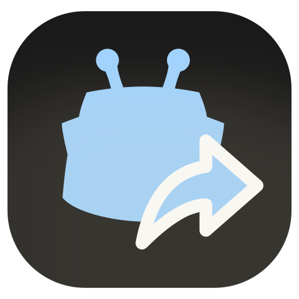
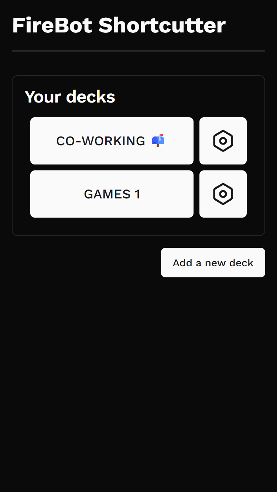
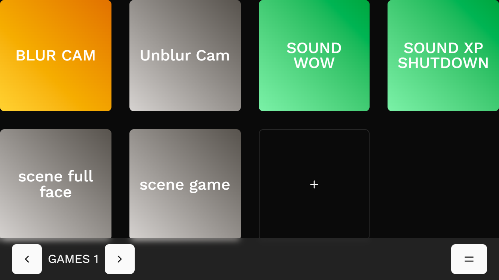

<!-- Improved compatibility of back to top link: See: https://github.com/othneildrew/Best-README-Template/pull/73 -->

<!-- PROJECT SHIELDS -->
<!--
*** I'm using markdown "reference style" links for readability.
*** Reference links are enclosed in brackets [ ] instead of parentheses ( ).
*** See the bottom of this document for the declaration of the reference variables
*** for contributors-url, forks-url, etc. This is an optional, concise syntax you may use.
*** https://www.markdownguide.org/basic-syntax/#reference-style-links
-->

<!-- PROJECT LOGO -->
 

  

  <h3 align="center">FireBot Shortcutter</h3>

  

    FireBot preset effects available (locally) via configurable quick action tiles in a web-app
  

<!-- ABOUT THE PROJECT -->

## About The Project

This project is a quick tool I built for myself to execute FireBot effect preset lists from my phone using a grid of configurable buttons.

(<a href="#readme-top">back to top</a>)

<!-- GETTING STARTED -->

## Getting Started

### Prerequisites

You will need a node compatible js runtime. I do not package an executable for the release. Bun or Node (>22) should both work.

### Installation

#### Using the release dist (recommended)

1. Download the latest release from releases

(<a href="#readme-top">back to top</a>)

<!-- CONTRIBUTING -->

## Contributing

Contributions are welcome. Open a pull request.

(<a href="#readme-top">back to top</a>)

<!-- LICENSE -->

## License

Distributed under the GPLv3 License

(<a href="#readme-top">back to top</a>)

